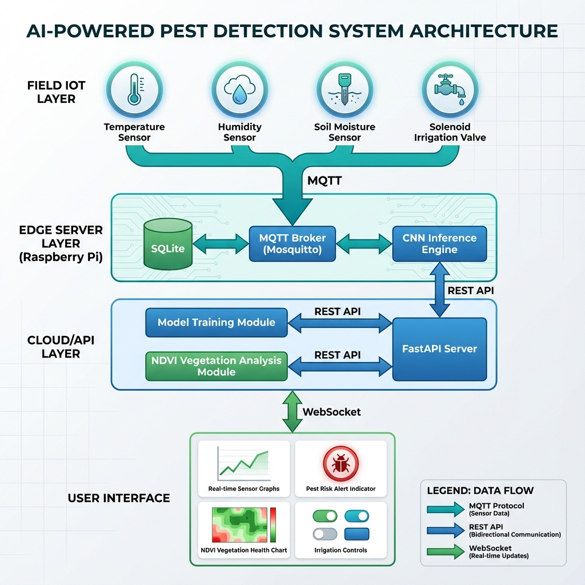
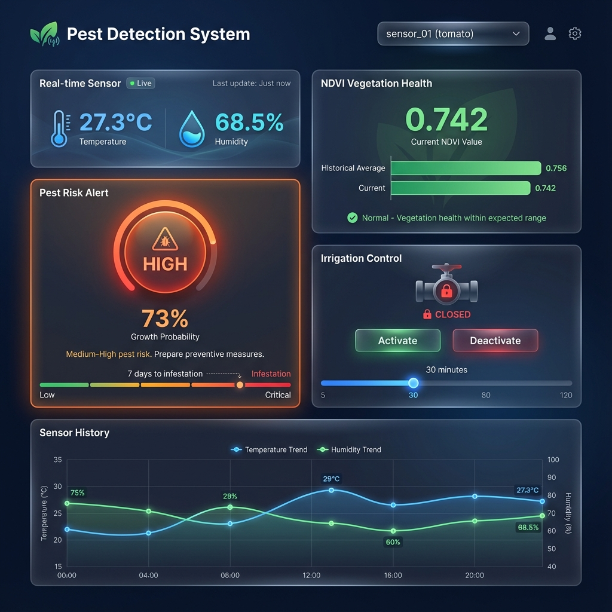
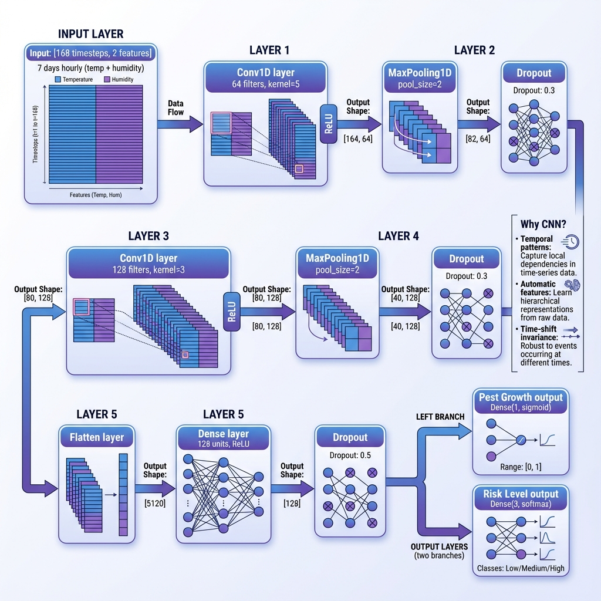

# AI-Powered Pest Prediction and Detection System

[](https://www.python.org/downloads/)
[](https://www.tensorflow.org/)
[](https://fastapi.tiangolo.com/)
[](https://opensource.org/licenses/MIT)

**Production-quality, end-to-end pest prediction system** that combines IoT sensor networks, MQTT-based communication, CNN-based pest growth forecasting, and satellite-based vegetation health monitoring using NDVI.



---

## 🌟 Key Innovations

This system **differentiates from existing solutions** by being:

| Traditional Systems | This System |
|---|---|
| **Reactive** - Respond after crop damage | **Predictive** - Forecast 7-10 days in advance |
| **Image-only** - Vision-based pest detection | **Multi-modal** - Sensor data + satellite fusion |
| **Internet-dependent** - Requires constant connectivity | **Edge-first** - Operates offline with local MQTT broker |
| **Generic** - Non-specific alerts | **Crop-aware** - Pest-specific and crop-specific |

> **"The crop is damaged"** → **"You have a 70% chance of infestation next week—act now."**

---

## 📸 Dashboard Preview



*Real-time monitoring dashboard showing sensor data, pest risk alerts, NDVI vegetation health, and irrigation controls*

---

## 📖 Table of Contents

- [System Architecture](#system-architecture)
- [Quick Start](#quick-start)
- [Installation](#installation)
- [Usage Guide](#usage-guide)
- [Model Training](#model-training)
- [API Documentation](#api-documentation)
- [Dashboard](#dashboard)
- [Deployment](#deployment)
- [Configuration](#configuration)
- [Troubleshooting](#troubleshooting)
- [Future Extensions](#future-extensions)
- [Contributing](#contributing)

---

## 🏗️ System Architecture

```
┌─────────────────────────────────────────────────────────────┐
│                  🌾 FIELD LAYER                             │
│  ┌─────────┐  ┌─────────┐  ┌─────────┐  ┌─────────┐        │
│  │ Temp    │  │ Humidity│  │  Soil   │  │ Solenoid│        │
│  │ Sensor  │  │ Sensor  │  │Moisture │  │  Valve  │        │
│  └────┬────┘  └────┬────┘  └────┬────┘  └────┬────┘        │
│       │            │            │            │              │
│       └────────────┴────────────┴────────────┘              │
│                     MQTT                                    │
└────────────────────────┬────────────────────────────────────┘
                         │
┌────────────────────────┴────────────────────────────────────┐
│           💻 EDGE SERVER LAYER (Raspberry Pi)               │
│  ┌──────────────┐  ┌──────────────┐  ┌──────────────┐      │
│  │ MQTT Broker  │  │   SQLite DB  │  │   Inference  │      │
│  │ (Mosquitto)  │  │  (Time-Series│  │    Engine    │      │
│  └──────────────┘  └──────────────┘  └──────────────┘      │
└────────────────────────┬────────────────────────────────────┘
                         │
┌────────────────────────┴────────────────────────────────────┐
│              ☁️ CLOUD / API LAYER                           │
│  ┌──────────────┐  ┌──────────────┐  ┌──────────────┐      │
│  │ Model        │  │ NDVI         │  │   FastAPI    │      │
│  │ Training     │  │ Analysis     │  │   Server     │      │
│  └──────────────┘  └──────────────┘  └──────────────┘      │
└────────────────────────┬────────────────────────────────────┘
                         │
┌────────────────────────┴────────────────────────────────────┐
│             📱 FARMER DASHBOARD                             │
│  Real-time Monitoring | Pest Alerts | NDVI | Irrigation    │
└─────────────────────────────────────────────────────────────┘
```

---

## 🚀 Quick Start

```bash
# 1. Clone repository
cd /Users/pranavdwivedi/Public/Coding\ Projects/pest-detection

# 2. Create virtual environment
python3 -m venv venv
source venv/bin/activate  # On Windows: venv\Scripts\activate

# 3. Install dependencies
pip install -r requirements.txt

# 4. Generate synthetic dataset and train model
python data_pipeline/synthetic_dataset.py --samples 2000
python pest_model/train.py --generate

# 5. Start MQTT broker (in separate terminal)
mosquitto -c /usr/local/etc/mosquitto/mosquitto.conf -v

# 6. Start sensor simulator (in separate terminal)
python iot_clients/sensor_node.py --device-id sensor_01 --crop tomato --pest aphids

# 7. Start MQTT subscriber (in separate terminal)
python mqtt_server/subscriber.py

# 8. Start API server
python api/main.py

# 9. Open dashboard
open http://localhost:8000
```

---

## 📦 Installation

### Prerequisites

- **Python 3.8+**
- **MQTT Broker** (Mosquitto recommended)
- **Node.js** (optional, for advanced dashboard features)

### Detailed Installation

```bash
# Install Mosquitto MQTT broker
## macOS
brew install mosquitto
brew services start mosquitto

## Ubuntu/Debian
sudo apt-get install mosquitto mosquitto-clients
sudo systemctl start mosquitto

# Install Python dependencies
pip install -r requirements.txt
```

---

## 📚 Usage Guide

### 1. Data Generation & Model Training

```bash
# Generate synthetic training data
python data_pipeline/synthetic_dataset.py \
    --samples 2000 \
    --days 7 \
    --output data/synthetic_pest_dataset.csv

# Train CNN model
python pest_model/train.py \
    --dataset data/synthetic_pest_dataset.csv \
    --generate

# Model will be saved to: models/pest_prediction_model
# Training metrics saved to: models/training_results.json
```

### 2. Running IoT Sensors

```bash
# Sensor node (simulated)
python iot_clients/sensor_node.py \
    --device-id sensor_01 \
    --crop tomato \
    --pest aphids \
    --duration 3600  # Run for 1 hour

# Irrigation controller
python iot_clients/irrigation_controller.py \
    --device-id valve_01 \
    --crop tomato
```

### 3. MQTT Data Ingestion

```bash
# Start MQTT subscriber to ingest sensor data
python mqtt_server/subscriber.py

# Data will be stored in: data/pest_detection.db
```

### 4. Running the API Server

```bash
# Start FastAPI server
python api/main.py

# API will be available at: http://localhost:8000
# Interactive docs at: http://localhost:8000/docs
```

### 5. Accessing the Dashboard

Open your browser and navigate to:
```
http://localhost:8000
```

---

## 🧠 Model Training

### Why CNN over Traditional ML?

The system uses a **1D Convolutional Neural Network** instead of traditional ML algorithms because:

1. **Temporal Pattern Recognition**: CNNs excel at detecting local patterns in sequential data (e.g., 3-day heat waves)
2. **Automatic Feature Learning**: No manual feature engineering required
3. **Invariance to Time Shifts**: Patterns detected regardless of when they occur
4. **Multi-scale Analysis**: Different kernel sizes capture hourly and daily patterns simultaneously
5. **Edge Deployment**: Lightweight enough for Raspberry Pi inference

### CNN Architecture



*Multi-task CNN architecture for pest growth regression and risk classification*

```
Input: [batch, 168 hours, 2 features (temp + humidity)]
   ↓
Conv1D(64 filters, kernel=5) + ReLU → 5-hour patterns
   ↓
MaxPooling1D(2) → Downsample
   ↓
Dropout(0.3)
   ↓
Conv1D(128 filters, kernel=3) + ReLU → 3-hour patterns
   ↓
MaxPooling1D(2)
   ↓
Flatten → Dense(128) + ReLU
   ↓
Output heads:
  • Pest Growth: Dense(1, sigmoid) → [0, 1]
  • Risk Level: Dense(3, softmax) → {Low, Medium, High}
```

### Training Results

Expected performance on synthetic data:
- **Growth Prediction MAE**: < 0.10 (on 0-1 scale)
- **Risk Classification Accuracy**: > 80%

---

## 🔌 API Documentation

### REST Endpoints

| Endpoint | Method | Description |
|---|---|---|
| `/api/health` | GET | Health check |
| `/api/sensors/{device_id}/latest` | GET | Latest sensor reading |
| `/api/sensors/{device_id}/history` | GET | Historical data |
| `/api/sensors/all` | GET | List all devices |
| `/api/predict/pest` | POST | Run pest prediction |
| `/api/alerts/{crop_type}` | GET | Active alerts |
| `/api/ndvi/{plot_id}/current` | GET | Current NDVI |
| `/api/ndvi/{plot_id}/compare` | GET | NDVI comparison |
| `/api/irrigation/{device_id}/activate` | POST | Activate valve |
| `/api/irrigation/{device_id}/deactivate` | POST | Deactivate valve |

### Example: Run Pest Prediction

```bash
curl -X POST "http://localhost:8000/api/predict/pest?device_id=sensor_01"
```

**Response:**
```json
{
  "device_id": "sensor_01",
  "prediction": {
    "growth_probability": 0.73,
    "growth_percentage": 73,
    "risk_level": "High",
    "days_to_infestation": 7
  },
  "alert": {
    "should_alert": true,
    "message": "⚠️  WARNING: Medium-High pest risk (73%). Prepare preventive measures.",
    "severity": "High"
  }
}
```

---

## 📊 Dashboard

The farmer dashboard provides:

1. **Real-time Sensor Monitoring**: Live temperature and humidity
2. **Pest Risk Alerts**: Visual risk indicators with timelines
3. **NDVI Vegetation Health**: Current vs historical comparison
4. **Irrigation Control**: Manual valve activation/deactivation
5. **Sensor History Charts**: 24-hour trend visualization

### Dashboard Features

- ✅ **Responsive Design**: Mobile-friendly
- ✅ **Dark Mode**: Optimized for field use
- ✅ **WebSocket Updates**: Real-time data streaming
- ✅ **Low Bandwidth**: Optimized for rural 3G/4G
- ✅ **Offline Capability**: Service worker support (extendable)

---

## 🚢 Deployment

### Edge Deployment (Raspberry Pi)

```bash
# 1. Install on Raspberry Pi
sudo apt-get update
sudo apt-get install python3-pip mosquitto

# 2. Copy project files
scp -r pest-detection/ pi@192.168.1.100:/home/pi/

# 3. SSH into Pi and install dependencies
ssh pi@192.168.1.100
cd pest-detection
pip3 install -r requirements.txt

# 4. Set up systemd services for auto-start
# (Example service files in deployment/ folder)

# 5. Configure GPIO pins for actual sensors
# Edit config.yaml irrigation section
```

### Cloud Deployment (Optional)

For cloud-based API:

```bash
# Using Docker
docker build -t pest-detection-api .
docker run -p 8000:8000 pest-detection-api

# Using cloud providers
# Deploy to AWS Lambda, Google Cloud Run, or Azure Functions
```

---

## ⚙️ Configuration

All settings are in `config.yaml`:

```yaml
mqtt:
  broker_host: "localhost"  # Change to Pi IP for remote sensors
  broker_port: 1883

model:
  sequence_length: 168  # 7 days @ hourly
  epochs: 100
  batch_size: 32

alerts:
  pest_risk:
    low: 0.3
    medium: 0.6
    high: 0.8

irrigation:
  auto_mode: false  # Set true for automated control
  max_duration_minutes: 60
```

---

## 🛠️ Troubleshooting

### Model training fails
```bash
# Ensure sufficient data generated
python data_pipeline/synthetic_dataset.py --samples 2000

# Check TensorFlow installation
python -c "import tensorflow as tf; print(tf.__version__)"
```

### MQTT connection issues
```bash
# Test broker
mosquitto_sub -h localhost -t "field/#" -v

# Check firewall
sudo ufw allow 1883/tcp
```

### Dashboard not loading
```bash
# Check API server logs
python api/main.py

# Verify static files exist
ls dashboard/index.html dashboard/css/styles.css dashboard/js/app.js
```

---

## 🔮 Future Extensions

### 1. Vision-Based Pest Identification
```python
# TODO: Add camera module integration
# Use MobileNetV2 for real-time leaf image classification
# Cross-validate visual detection with environmental predictions
```

### 2. Reinforcement Learning for Irrigation
```python
# TODO: RL agent to optimize irrigation timing
# State: sensor data, NDVI, pest risk
# Action: valve open duration
# Reward: yield - water_cost - pest_damage_cost
```

### 3. SMS Alert System
```python
# TODO: Twilio integration for low-connectivity farmers
# Send SMS 24-48 hours before predicted outbreaks
```

### 4. Government-Scale Forecasting
```python
# TODO: Aggregate multi-farm data
# Train regional pest outbreak models
# Provide early warnings to agricultural departments
```

---

## 🎯 Production Considerations

### Model Limitations

⚠️ **Current Limitations:**
- Synthetic training data used for demonstration
- CNN temporal patterns may not generalize across different climates
- NDVI requires cloud-free satellite imagery
- Pest species diversity limited to 3-5 major pests initially

### Sensor Calibration

📌 **Important:**
- DHT22 accuracy: ±0.5°C (temperature), ±2% RH (humidity)
- Sensors should be in shaded, well-ventilated enclosures
- Monthly calibration checks recommended

### Rural Deployment Constraints

🌐 **Network Considerations:**
- Intermittent internet connectivity (4G/3G with dropouts)
- Limited bandwidth (optimize payload sizes < 10KB)
- Power reliability issues (UPS/solar backup for edge server)

---

## 📄 License

This project is released under the MIT License.

---

## 👥 Contributing

Contributions welcome! Areas for improvement:
- Integration with real historical pest data
- Support for additional crop types and pests
- Advanced NDVI time-series forecasting
- Mobile app development
- Multi-language dashboard support

---

## 📞 Support

For issues, questions, or feature requests, please open an issue on GitHub.

---

## 🙏 Acknowledgments

- **TensorFlow** for the deep learning framework
- **FastAPI** for the modern Python web framework
- **Mosquitto** for the MQTT broker
- **Chart.js** for dashboard visualizations
- Agricultural extension services for domain expertise

---

**Built with ❤️ for sustainable agriculture and farmer empowerment**
